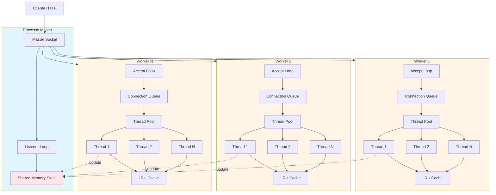
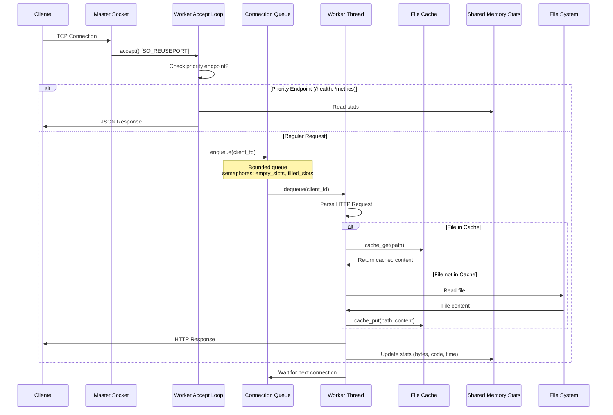
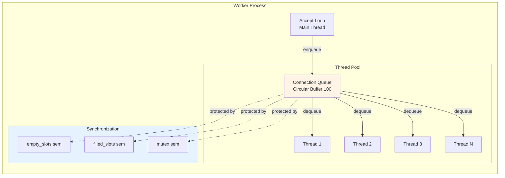
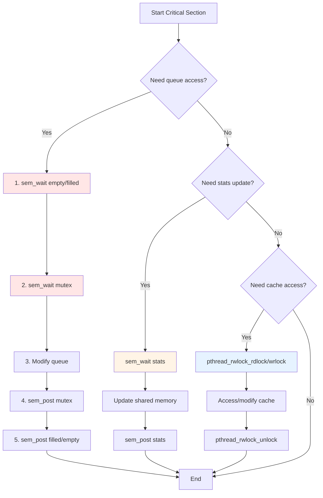
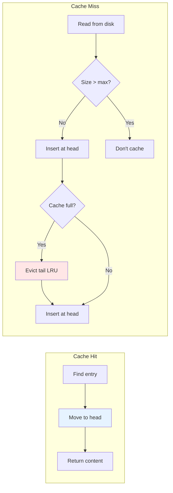

# 📘 Documento de Design — Servidor HTTP Multi-Processo

## 1. Introdução

### 1.1 Propósito do Sistema
Servidor HTTP de alto desempenho implementado em C que utiliza arquitetura master-worker com IPC (Inter-Process Communication) baseado em memória compartilhada e semáforos POSIX para processar requisições de forma concorrente e eficiente.

### 1.2 Escopo
- Servidor HTTP/1.1 com suporte a GET
- Arquitetura prefork com múltiplos workers
- Thread pool por worker para processamento concorrente
- Cache LRU de arquivos estáticos
- Estatísticas globais em memória compartilhada
- Endpoints de monitoramento (/health, /metrics, /stats)

### 1.3 Resumo da Arquitetura
Sistema baseado em processo master que cria N workers. Cada worker possui um thread pool que consome conexões de uma fila circular limitada, processa requisições HTTP e atualiza estatísticas em memória compartilhada protegida por semáforos POSIX.

---

## 2. Arquitetura de Alto Nível

### 2.1 Diagrama Master-Worker



### 2.2 Diagrama de Fluxo de Dados



### 2.3 Componentes IPC

```mermaid
graph LR
    subgraph "Shared Memory Region"
        direction TB
        SS[server_stats_t]
        SS --> TR[total_requests]
        SS --> BS[bytes_sent]
        SS --> HC[http_code_counts]
        SS --> AC[active_connections]
        SS --> RT[response_time]
        SS --> SEM[sem_t semaphore]
    end
    
    subgraph "Named Semaphores"
        SEM1[/stats_semaphore]
    end
    
    W1[Worker 1] -.sem_wait/post.-> SEM1
    W2[Worker 2] -.sem_wait/post.-> SEM1
    WN[Worker N] -.sem_wait/post.-> SEM1
    
    SEM1 --> SS
    
    style SS fill:#ffe6e6
    style SEM1 fill:#e6f3ff
```

---

## 3. Arquitetura de Processos

### 3.1 Responsabilidades do Processo Master

```c
// main.c: Master process
```

**Funções principais:**
- Carrega configuração (`server.conf`)
- Inicializa logger e estatísticas em shared memory
- Cria socket TCP com `SO_REUSEPORT`
- Realiza fork de N processos workers
- Monitora workers e exibe estatísticas globais a cada 30 segundos
- Aguarda sinal de shutdown (SIGINT/SIGTERM)
- Realiza cleanup de recursos compartilhados

**Não processa requisições diretamente.**

### 3.2 Responsabilidades de Cada Worker

```c
// server.c: worker_process()
```

**Funções principais:**
- Herda socket do master (compartilhado via `SO_REUSEPORT`)
- Inicializa cache LRU local (não compartilhado)
- Inicializa connection queue com semáforos
- Cria thread pool com N threads
- Loop infinito de `accept()` para conexões
- Verifica endpoints prioritários antes de enfileirar
- Enfileira conexões regulares para thread pool
- Envia 503 se fila estiver cheia

### 3.3 Estrutura do Thread Pool por Worker



**Estrutura:**
```c
typedef struct {
    connection_queue_t* queue;
    int active_threads;
    pthread_mutex_t active_mutex;
} thread_pool_t;
```

---

## 4. Design de Sincronização

### 4.1 Semáforos POSIX para IPC

**Named Semaphore para Shared Memory Stats:**
```c
// stats.c
sem_t semaphore;  // Protects server_stats_t in shared memory
```

**Região crítica:**
- Leitura/escrita de `total_requests`, `bytes_sent`, `http_code_counts`
- Incremento/decremento de `active_connections`
- Atualização de `total_response_time_ms`

**Protocolo:**
```c
sem_wait(&stats->semaphore);
// Critical section: update stats
stats->total_requests++;
sem_post(&stats->semaphore);
```

**Sem deadlock:** Único semáforo, tempo de posse mínimo.

### 4.2 Semáforos para Connection Queue

```c
// connection_queue.h
typedef struct {
    int connections[QUEUE_SIZE];
    int head;
    int tail;
    
    sem_t empty_slots;   // Producer wait
    sem_t filled_slots;  // Consumer wait
    sem_t mutex;         // Mutual exclusion
    
    int shutdown;
} connection_queue_t;
```

**Producer (accept loop):**
```c
sem_wait(&queue->empty_slots);   // Wait for space
sem_wait(&queue->mutex);         // Lock queue
queue->connections[queue->tail] = client_fd;
queue->tail = (queue->tail + 1) % QUEUE_SIZE;
sem_post(&queue->mutex);         // Unlock queue
sem_post(&queue->filled_slots);  // Signal consumers
```

**Consumer (thread pool):**
```c
sem_wait(&queue->filled_slots);  // Wait for work
sem_wait(&queue->mutex);         // Lock queue
int fd = queue->connections[queue->head];
queue->head = (queue->head + 1) % QUEUE_SIZE;
sem_post(&queue->mutex);         // Unlock queue
sem_post(&queue->empty_slots);   // Signal producers
```

**Prevenção de deadlock:**
- Ordem de locking fixa: `empty_slots` → `mutex` → `filled_slots`
- Tempo de lock mínimo (apenas acesso ao buffer)
- Shutdown flag para evitar espera infinita

### 4.3 Pthread Mutexes

**Thread Pool Active Counter:**
```c
// thread_pool.c
pthread_mutex_t active_mutex;  // Protects active_threads count
```

Usado para rastrear threads ativas sem contenção de shared memory.

### 4.4 Reader-Writer Locks (Cache LRU)

```c
// file_cache.c
pthread_rwlock_t lock;  // RW lock for cache
```

**Leitura (múltiplos readers):**
```c
pthread_rwlock_rdlock(&cache->lock);
entry = find_entry(cache, path);
pthread_rwlock_unlock(&cache->lock);
```

**Escrita (exclusiva):**
```c
pthread_rwlock_wrlock(&cache->lock);
// Evict LRU entry
// Insert new entry
// Update LRU order
pthread_rwlock_unlock(&cache->lock);
```

**Benefícios:**
- Múltiplas threads podem ler cache simultaneamente
- Apenas uma thread modifica por vez
- Evita contenção excessiva em workloads read-heavy

### 4.5 Prevenção de Race Conditions

**Estratégias:**
1. **Shared memory stats:** Sempre protegida por `sem_wait/post`
2. **Connection queue:** Bounded buffer com 3 semáforos
3. **Cache per-worker:** RW lock para acesso concorrente
4. **Socket accept:** `SO_REUSEPORT` permite accept paralelo sem lock

**Invariantes:**
- `queue->head != queue->tail` quando fila não vazia
- `stats->active_connections >= 0`
- Cache size `<= max_size`

### 4.6 Ordem de Locking



**Regras:**
- Nunca segurar múltiplos locks simultaneamente (exceto queue: empty→mutex→filled)
- Locks internos (cache, active_threads) nunca interagem com shared memory locks
- Tempo de posse mínimo para evitar contenção

---

## 5. Estruturas de Dados

### 5.1 Layout de Memória Compartilhada

```c
// stats.h - Mapped to /dev/shm/server_stats
typedef struct {
    int total_requests;
    int bytes_sent;
    
    // HTTP status codes
    int http_200_count;
    int http_404_count;
    int http_500_count;
    
    int active_connections;
    
    // Response time tracking
    long long total_response_time_ms;
    int response_count;
    
    // Snapshot for /metrics
    long long last_total_response_time_ms;
    int last_response_count;
    
    sem_t semaphore;  // Named semaphore embedded
} server_stats_t;
```

**Criação:**
```c
shm_fd = shm_open("/server_stats", O_CREAT | O_RDWR, 0666);
ftruncate(shm_fd, sizeof(server_stats_t));
stats = mmap(NULL, sizeof(server_stats_t), PROT_READ | PROT_WRITE,
             MAP_SHARED, shm_fd, 0);
sem_init(&stats->semaphore, 1, 1);  // pshared=1
```

### 5.2 Fila de Thread Pool

```c
// connection_queue.h
#define QUEUE_SIZE 100

typedef struct {
    int connections[QUEUE_SIZE];  // Circular buffer
    int head;                     // Consumer index
    int tail;                     // Producer index
    
    sem_t empty_slots;   // Initially QUEUE_SIZE
    sem_t filled_slots;  // Initially 0
    sem_t mutex;         // Binary semaphore
    
    int shutdown;
} connection_queue_t;
```

**Lógica circular:**
```c
// Enqueue
tail = (tail + 1) % QUEUE_SIZE;

// Dequeue
head = (head + 1) % QUEUE_SIZE;

// Size
size = (tail - head + QUEUE_SIZE) % QUEUE_SIZE;
```

### 5.3 Design do Cache LRU

```c
// file_cache.h
typedef struct cache_entry {
    char path[512];
    char* content;
    size_t content_size;
    time_t last_access;
    struct cache_entry* prev;  // Doubly-linked list
    struct cache_entry* next;
} cache_entry_t;

typedef struct {
    cache_entry_t* head;  // Most recently used
    cache_entry_t* tail;  // Least recently used
    size_t total_size;
    size_t max_size;
    int entry_count;
    pthread_rwlock_t lock;
} file_cache_t;
```

**Operações:**



**Eviction:**
- Remove tail (LRU)
- Libera `content` buffer
- Atualiza `total_size`

### 5.4 Buffer do Logger

```c
// logger.c - Thread-local ou per-worker
#define LOG_BUFFER_SIZE 4096

typedef struct {
    char buffer[LOG_BUFFER_SIZE];
    int offset;
    pthread_mutex_t lock;
    FILE* file;
} logger_t;
```

Cada worker tem logger independente (não compartilhado).

### 5.5 Estrutura de Configuração

```c
// config.h
typedef struct {
    int port;                    // TCP port
    char document_root[256];     // File path root
    int num_workers;             // Fork count
    int timeout_seconds;         // Socket timeout
    int cache_size_mb;           // Cache limit per worker
    int threads_per_worker;      // Thread pool size
} server_config_t;
```

Carregada de `server.conf`:
```ini
port=8080
document_root=./www
num_workers=4
timeout_seconds=30
cache_size_mb=50
threads_per_worker=8
```

---

## 6. Funcionalidades Adicionais

### 6.1 Endpoint `/health`

**Propósito:** Health check para load balancers e monitoramento.

**Resposta:**
```json
{
  "status": "healthy",
  "uptime": 3600,
  "workers": 4
}
```

**Implementação:**
- Processa **antes** de enfileirar (priority endpoint)
- Não consome recursos do thread pool
- Lê stats de shared memory
- Calcula uptime via `time(NULL) - start_time`

### 6.2 Endpoint `/metrics`

**Propósito:** Métricas estilo Prometheus para monitoramento.

**Resposta:**
```
http_requests_total 12543
http_bytes_sent_total 45123456
http_requests_by_code{code="200"} 12000
http_requests_by_code{code="404"} 543
http_active_connections 8
http_avg_response_time_ms 42.5
```

**Implementação:**
- Priority endpoint
- Lê snapshot de `last_total_response_time_ms` / `last_response_count`
- Calcula average response time
- Atualiza snapshot para próxima leitura

### 6.3 Endpoint `/stats`

**Propósito:** JSON detalhado para dashboards.

**Resposta:**
```json
{
  "total_requests": 12543,
  "bytes_sent": 45123456,
  "http_codes": {
    "200": 12000,
    "404": 543,
    "500": 0
  },
  "active_connections": 8,
  "avg_response_time_ms": 42.5
}
```

### 6.4 Contadores Adicionais em Shared Memory

**Campos extras em `server_stats_t`:**
- `total_response_time_ms`: Soma acumulada de tempos de resposta
- `response_count`: Contador de requisições para média
- `last_*`: Snapshot para cálculo de /metrics

**Medição de tempo de resposta:**
```c
struct timespec start, end;
clock_gettime(CLOCK_MONOTONIC, &start);
// Process request
clock_gettime(CLOCK_MONOTONIC, &end);
long long ms = (end.tv_sec - start.tv_sec) * 1000 +
               (end.tv_nsec - start.tv_nsec) / 1000000;
add_response_time(ms);
```

### 6.5 Integração no Modelo de Sincronização

**Priority endpoints não usam fila:**

```mermaid
graph TD
    A[accept client_fd] --> B{is_priority_endpoint?}
    B -->|Yes| C[Read request header<br/>MSG_PEEK]
    C --> D{Match /health | /metrics | /stats}
    D -->|Yes| E[sem_wait stats]
    E --> F[Generate JSON]
    F --> G[sem_post stats]
    G --> H[send response]
    H --> I[close fd]
    
    B -->|No| J[try_enqueue]
    J --> K{Queue full?}
    K -->|Yes| L[send_503]
    K -->|No| M[Thread pool processes]
    
    D -->|No| J
    
    style E fill:#ffe6e6
    style G fill:#ffe6e6
    style J fill:#fff4e6
```

**Benefícios:**
- Monitoramento sempre responsivo mesmo sob carga
- Não compete por slots de fila
- Acesso direto a shared memory stats

---

## 7. Decisões de Design e Alternativas

### 7.1 Arquitetura Master-Worker vs Thread-Only

**Escolha: Master-Worker com thread pool**

**Razões:**
- Isolamento de falhas (crash de worker não derruba servidor)
- Cache per-worker reduz contenção
- `SO_REUSEPORT` permite accept paralelo sem thundering herd
- Prefork evita overhead de fork por requisição

**Alternativa rejeitada:** Servidor single-process com apenas threads
- Mais contenção no cache global
- Crash derruba todo servidor

### 7.2 Shared Memory com Semáforos vs Message Queues

**Escolha: Shared memory (`shm_open` + `mmap`) com semáforos**

**Razões:**
- Acesso direto sem serialização
- Latência mínima para atualização de stats
- Múltiplos workers podem ler/escrever simultaneamente

**Alternativa rejeitada:** POSIX message queues
- Overhead de serialização
- Limit de tamanho de mensagem
- Mais complexo para agregação de stats

### 7.3 Fila Circular Limitada vs Fila Ilimitada

**Escolha: Bounded queue (100 slots) com semáforos**

**Razões:**
- Backpressure natural sob carga
- Evita estouro de memória
- Retorna 503 explicitamente quando sobrecarregado

**Alternativa rejeitada:** Fila ilimitada com malloc
- Sem controle de carga
- Possível OOM sob ataque
- Timeouts ruins para clientes

### 7.4 Cache LRU per-Worker vs Cache Global

**Escolha: Cache LRU separado por worker**

**Razões:**
- Reduz contenção (RW lock apenas dentro do worker)
- Melhor localidade de cache CPU
- Failure isolation

**Alternativa rejeitada:** Cache global em shared memory
- Contenção massiva de lock
- Complexidade de gerenciar malloc em shared memory
- Single point of contention

### 7.5 Reader-Writer Lock vs Mutex no Cache

**Escolha: `pthread_rwlock_t`**

**Razões:**
- Workload read-heavy (cache hits >> cache misses)
- Múltiplas threads podem ler simultaneamente
- Write lock apenas em eviction

**Alternativa rejeitada:** Mutex simples
- Serializa todas as leituras
- Perda de paralelismo

### 7.6 Priority Endpoints vs Fila Única

**Escolha: Processar `/health`, `/metrics`, `/stats` antes de enfileirar**

**Razões:**
- Monitoramento sempre acessível sob carga
- Evita timeouts de health checks
- Não consome slots de fila

**Alternativa rejeitada:** Tudo via thread pool
- Health checks falham quando fila cheia
- Load balancers removem servidor saudável

### 7.7 Semáforos vs Condition Variables para Queue

**Escolha: Semáforos POSIX (`sem_init`)**

**Razões:**
- API mais simples para bounded buffer
- `empty_slots` e `filled_slots` modelam naturalmente produtor-consumidor
- Funciona entre processos (worker threads pertencem ao mesmo processo)

**Alternativa rejeitada:** Condition variables
- Requer mutex + cond para mesma semântica
- Mais verboso
- Menos intuitivo para contadores

---

## Resumo de Sincronização

| Recurso | Mecanismo | Propósito |
|---------|-----------|-----------|
| `server_stats_t` (shared mem) | Named semaphore | Protege leitura/escrita de estatísticas globais |
| `connection_queue_t` | 3 semáforos (empty, filled, mutex) | Producer-consumer bounded buffer |
| `file_cache_t` | `pthread_rwlock_t` | Permite múltiplas leituras, escrita exclusiva |
| `thread_pool->active_mutex` | `pthread_mutex_t` | Conta threads ativas localmente |

**Ordem de aquisição:** Nunca segurar múltiplos locks globais simultaneamente.

**Invariante de segurança:** Cada região crítica tem tempo de posse O(1) para evitar contenção excessiva.
