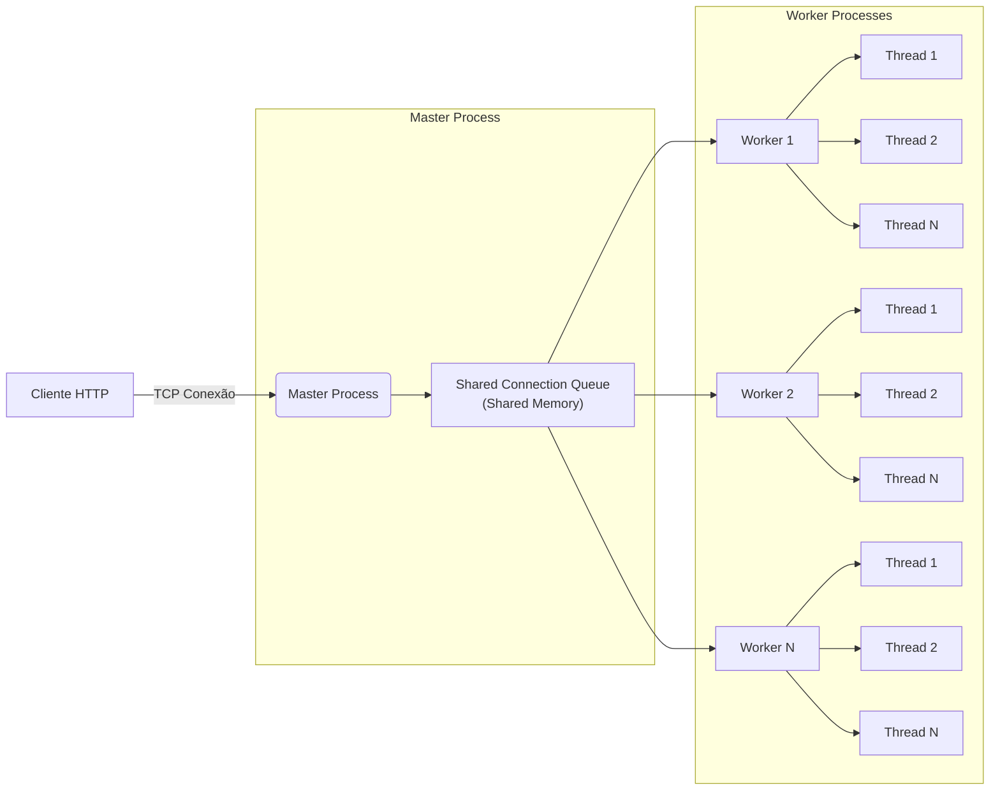
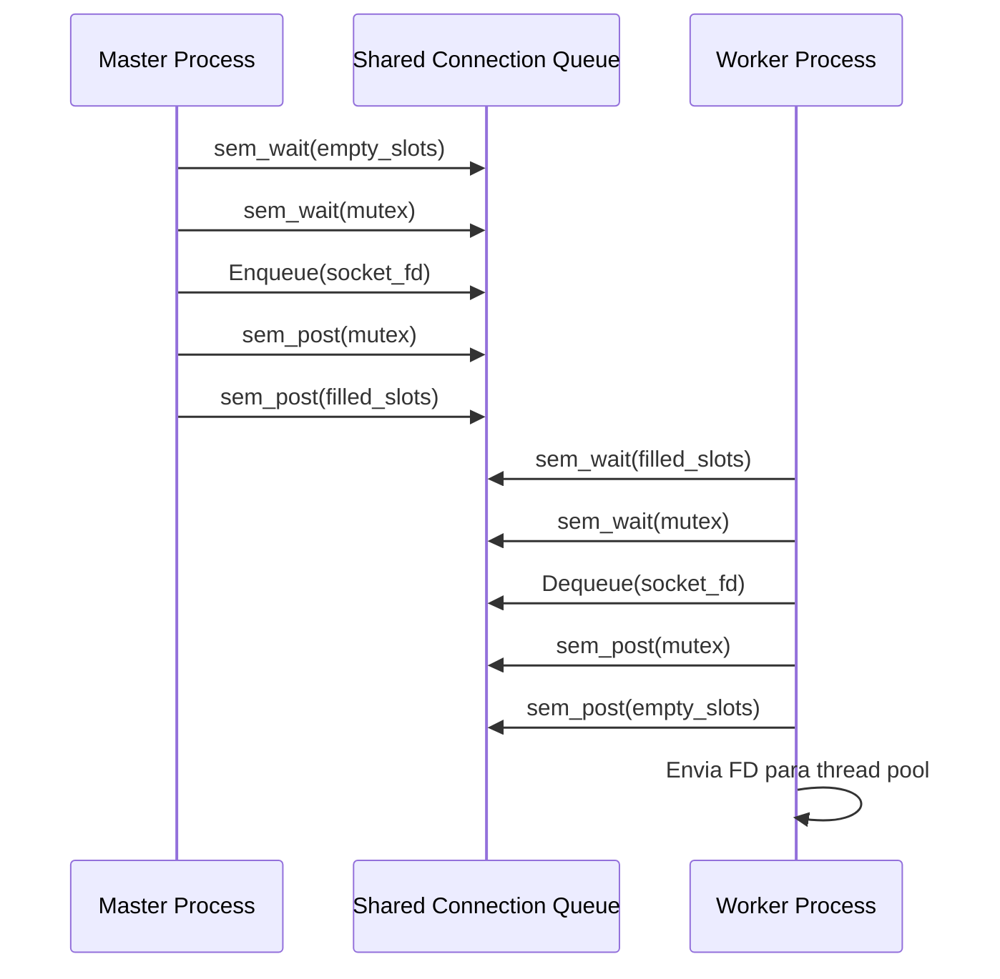
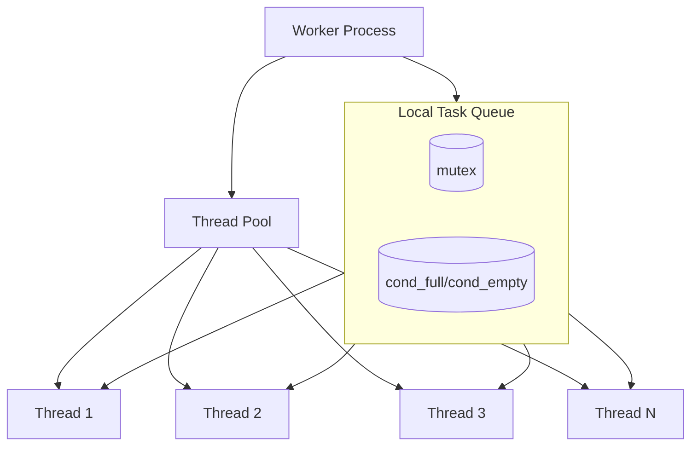
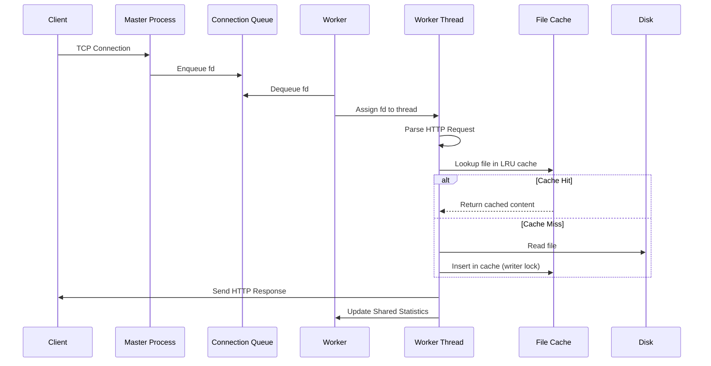
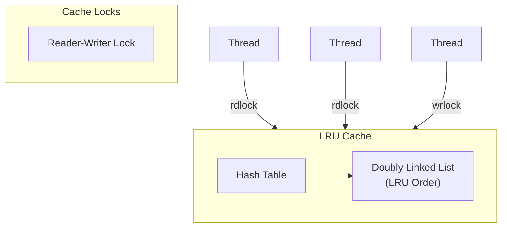
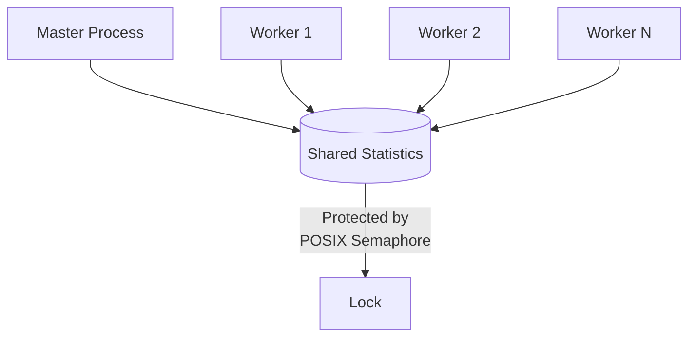
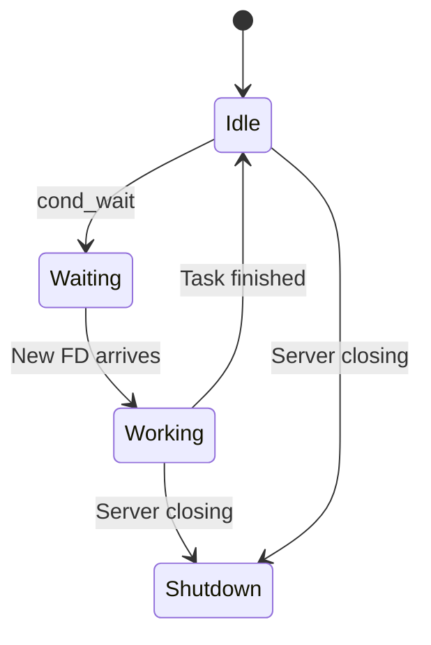

# 📘 **1. Arquitetura Geral (Master + Workers + Threads)**

---

# 📗 **2. Producer-Consumer com Semáforos (Fila de Ligações)**

---

# 📙 **3. Estrutura Interna do Worker (Thread Pool)**

---

# 📕 **4. Fluxo Completo do Pedido HTTP**

---

# 📓 **5. LRU File Cache (Estrutura e Sincronização)**

---

# 📒 **6. Estrutura das Estatísticas Partilhadas**

---

# 📘 **7. Diagrama de Estados do Thread Pool**

