# 📘 **1. Arquitetura Geral (Master + Workers + Threads)**

```mermaid
flowchart LR
    A[Cliente HTTP] -->|TCP Conexão| B(Master Process)

    subgraph MASTER[Master Process]
        B --> C["Shared Connection Queue<br>(Shared Memory)"]
    end

    subgraph WORKERS[Worker Processes]
        direction LR
        W1[Worker 1] --> T1a[Thread 1]
        W1 --> T1b[Thread 2]
        W1 --> T1c[Thread N]

        W2[Worker 2] --> T2a[Thread 1]
        W2 --> T2b[Thread 2]
        W2 --> T2c[Thread N]

        WN[Worker N] --> TNa[Thread 1]
        WN --> TNb[Thread 2]
        WN --> TNc[Thread N]
    end

    C --> W1
    C --> W2
    C --> WN
```

---

# 📗 **2. Producer-Consumer com Semáforos (Fila de Ligações)**

---

# 📙 **3. Estrutura Interna do Worker (Thread Pool)**

---

# 📕 **4. Fluxo Completo do Pedido HTTP**

---

# 📓 **5. LRU File Cache (Estrutura e Sincronização)**

---

# 📒 **6. Estrutura das Estatísticas Partilhadas**

---

# 📘 **7. Diagrama de Estados do Thread Pool**

