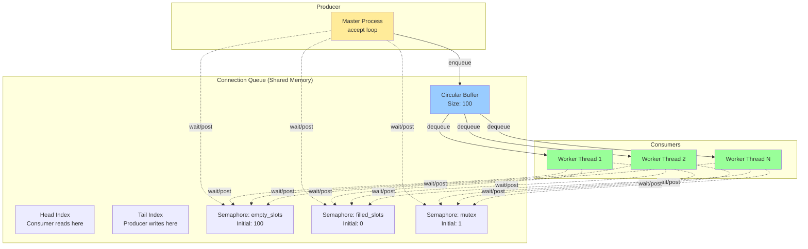
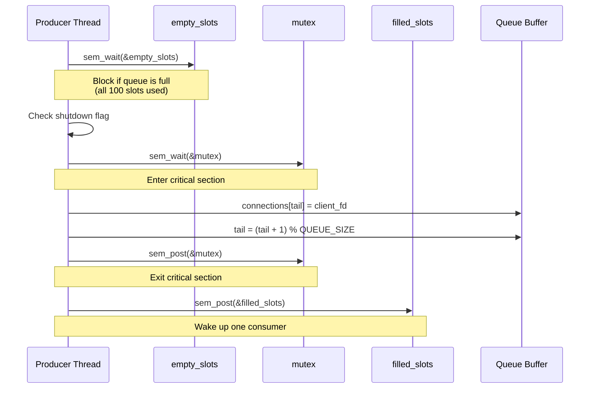
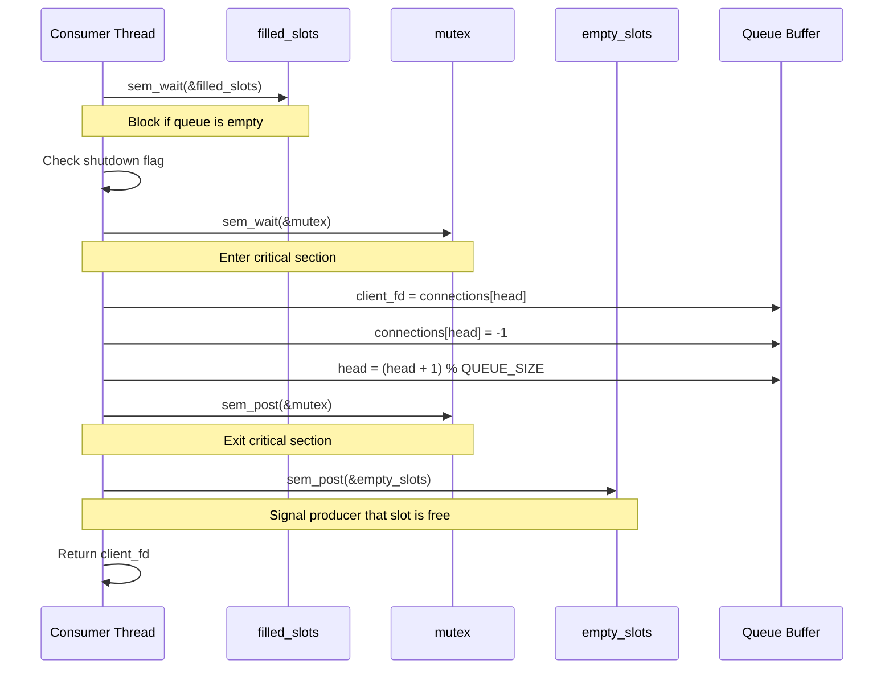

# Shared Queue Implementation: Producer-Consumer Pattern

**Project:** Concurrent HTTP Server  
**Module:** Connection Queue  
**Version:** 1.0  
**Date:** December 12, 2025  
**Author:** System Architecture Team

---

## Table of Contents

1. [Overview](#1-overview)
2. [Design Rationale](#2-design-rationale)
3. [Architecture](#3-architecture)
4. [Implementation Details](#4-implementation-details)
5. [Synchronization Mechanisms](#5-synchronization-mechanisms)
6. [Queue Operations](#6-queue-operations)
7. [Error Handling](#7-error-handling)
8. [Performance Considerations](#8-performance-considerations)
9. [Usage Examples](#9-usage-examples)
10. [Testing and Validation](#10-testing-and-validation)

---

## 1. Overview

### 1.1 Introduction

The connection queue module implements a **bounded circular buffer** using the classic **Producer-Consumer** pattern with POSIX semaphores for synchronization. This design ensures thread-safe, efficient handling of incoming client connections in a multi-threaded environment.

### 1.2 Key Features

- **Bounded Buffer:** Fixed size of 100 connections prevents memory exhaustion
- **Circular Queue:** Efficient O(1) enqueue/dequeue operations
- **Semaphore-Based Synchronization:** Three semaphores for coordination
- **Graceful Overload Handling:** Returns 503 Service Unavailable when full
- **Thread-Safe:** Multiple consumers can safely dequeue concurrently
- **Shutdown Support:** Clean termination of all waiting threads

### 1.3 Components

| Component | File | Description |
|-----------|------|-------------|
| Header | `connection_queue.h` | Interface and structure definitions |
| Implementation | `connection_queue.c` | Queue operations and synchronization |
| Integration | `server.c` | Producer (accept loop) integration |
| Thread Pool | `thread_pool.c` | Consumer (worker threads) integration |

---

## 2. Design Rationale

### 2.1 Why Producer-Consumer?

The Producer-Consumer pattern is ideal for this use case because:

1. **Decoupling:** Separates connection acceptance (producer) from request processing (consumers)
2. **Load Balancing:** Multiple consumers can process work in parallel
3. **Flow Control:** Bounded buffer prevents producer from overwhelming system
4. **Fairness:** FIFO ordering ensures fair connection handling

### 2.2 Why Semaphores?

Semaphores provide several advantages over other synchronization primitives:

- **Counting Semaphores:** Track both empty and filled slots efficiently
- **Blocking Semantics:** Threads sleep automatically when queue is empty/full
- **POSIX Standard:** Portable across UNIX-like systems
- **Kernel Support:** Efficient implementation with minimal overhead

### 2.3 Comparison with Alternatives

| Approach | Pros | Cons | Decision |
|----------|------|------|----------|
| **Mutex + Condition Variable** | Flexible, familiar | More complex code, potential spurious wakeups | ❌ Not chosen |
| **Lock-Free Queue** | High performance | Complex, architecture-dependent | ❌ Too complex |
| **Semaphores** | Simple, efficient, standard | Less flexible | ✅ **Selected** |
| **Unbounded Queue** | No rejections | Memory exhaustion risk | ❌ Unsafe |

---

## 3. Architecture

### 3.1 High-Level Design



### 3.2 Data Structure

```c
typedef struct {
    int connections[QUEUE_SIZE];  // Circular buffer (size: 100)
    int head;                      // Dequeue index (consumer)
    int tail;                      // Enqueue index (producer)
    
    // Synchronization primitives
    sem_t empty_slots;            // Counts available slots
    sem_t filled_slots;           // Counts occupied slots
    sem_t mutex;                  // Protects critical sections
    
    int shutdown;                 // Shutdown flag
} connection_queue_t;
```

### 3.3 Circular Buffer Logic

The queue uses modulo arithmetic for circular indexing:

```
Initial State:
head = 0, tail = 0
[_, _, _, _, _, ...] (100 empty slots)

After enqueue(fd1):
head = 0, tail = 1
[fd1, _, _, _, _, ...]

After enqueue(fd2):
head = 0, tail = 2
[fd1, fd2, _, _, _, ...]

After dequeue() → returns fd1:
head = 1, tail = 2
[_, fd2, _, _, _, ...]

Wrapping at end:
head = 99, tail = 0
[fd100, _, _, ..., fd99]
```

---

## 4. Implementation Details

### 4.1 Initialization

```c
int connection_queue_init(connection_queue_t* queue) {
    queue->head = 0;
    queue->tail = 0;
    queue->shutdown = 0;
    
    // Initialize all slots to -1 (invalid fd)
    memset(queue->connections, -1, sizeof(queue->connections));
    
    // empty_slots = QUEUE_SIZE (all slots available)
    sem_init(&queue->empty_slots, 0, QUEUE_SIZE);
    
    // filled_slots = 0 (no connections yet)
    sem_init(&queue->filled_slots, 0, 0);
    
    // mutex = 1 (binary semaphore for mutual exclusion)
    sem_init(&queue->mutex, 0, 1);
    
    return 0;
}
```

### 4.2 Semaphore Roles

| Semaphore | Initial Value | Purpose | Producer Behavior | Consumer Behavior |
|-----------|--------------|---------|-------------------|-------------------|
| `empty_slots` | 100 | Tracks free space | `wait()` before enqueue | `post()` after dequeue |
| `filled_slots` | 0 | Tracks pending work | `post()` after enqueue | `wait()` before dequeue |
| `mutex` | 1 | Critical section lock | `wait()` + `post()` | `wait()` + `post()` |

---

## 5. Synchronization Mechanisms

### 5.1 Producer (Enqueue) Flow



### 5.2 Consumer (Dequeue) Flow



### 5.3 Non-Blocking Enqueue (503 Handling)

```c
int connection_queue_try_enqueue(connection_queue_t* queue, int client_fd) {
    // Try to acquire empty slot WITHOUT blocking
    if (sem_trywait(&queue->empty_slots) != 0) {
        return -1;  // Queue is full, return immediately
    }
    
    // Check shutdown
    if (queue->shutdown) {
        sem_post(&queue->empty_slots);
        return -1;
    }
    
    // Critical section
    sem_wait(&queue->mutex);
    queue->connections[queue->tail] = client_fd;
    queue->tail = (queue->tail + 1) % QUEUE_SIZE;
    sem_post(&queue->mutex);
    
    // Signal consumer
    sem_post(&queue->filled_slots);
    
    return 0;
}
```

**Key Difference:** Uses `sem_trywait()` instead of `sem_wait()` to avoid blocking when queue is full.

---

## 6. Queue Operations

### 6.1 API Summary

| Function | Blocking | Returns | Use Case |
|----------|----------|---------|----------|
| `connection_queue_init()` | No | 0 or -1 | Initialization |
| `connection_queue_enqueue()` | Yes | 0 or -1 | Blocking enqueue |
| `connection_queue_try_enqueue()` | No | 0 or -1 | Non-blocking enqueue (503) |
| `connection_queue_dequeue()` | Yes | fd or -1 | Consumer operation |
| `connection_queue_size()` | No | int | Monitoring |
| `connection_queue_shutdown()` | No | void | Graceful shutdown |
| `connection_queue_destroy()` | No | void | Cleanup |

### 6.2 Enqueue Operation

**Blocking Version:**
```c
int connection_queue_enqueue(connection_queue_t* queue, int client_fd) {
    sem_wait(&queue->empty_slots);      // Wait for space
    if (queue->shutdown) return -1;
    
    sem_wait(&queue->mutex);            // Lock
    queue->connections[queue->tail] = client_fd;
    queue->tail = (queue->tail + 1) % QUEUE_SIZE;
    sem_post(&queue->mutex);            // Unlock
    
    sem_post(&queue->filled_slots);     // Signal consumer
    return 0;
}
```

**Non-Blocking Version (for 503):**
```c
int connection_queue_try_enqueue(connection_queue_t* queue, int client_fd) {
    if (sem_trywait(&queue->empty_slots) != 0) {
        return -1;  // Queue full, immediate return
    }
    // ... same as blocking version ...
}
```

### 6.3 Dequeue Operation

```c
int connection_queue_dequeue(connection_queue_t* queue) {
    sem_wait(&queue->filled_slots);     // Wait for work
    if (queue->shutdown) return -1;
    
    sem_wait(&queue->mutex);            // Lock
    int client_fd = queue->connections[queue->head];
    queue->connections[queue->head] = -1;
    queue->head = (queue->head + 1) % QUEUE_SIZE;
    sem_post(&queue->mutex);            // Unlock
    
    sem_post(&queue->empty_slots);      // Signal producer
    return client_fd;
}
```

### 6.4 Queue Size Calculation

```c
int connection_queue_size(connection_queue_t* queue) {
    sem_wait(&queue->mutex);
    
    int size;
    if (queue->tail >= queue->head) {
        size = queue->tail - queue->head;
    } else {
        size = QUEUE_SIZE - queue->head + queue->tail;
    }
    
    sem_post(&queue->mutex);
    return size;
}
```

---

## 7. Error Handling

### 7.1 Queue Full Scenario

When the queue is full (100 connections pending):

```c
// In server.c accept loop
if (connection_queue_try_enqueue(&conn_queue, client_fd) != 0) {
    // Queue is full - send 503 response
    send_503_response(client_fd);
    total_rejected++;
    
    // Throttle logging
    if (total_rejected % 100 == 1) {
        log_message("Queue full, rejected %lu connections", total_rejected);
    }
}
```

**503 Response:**
```http
HTTP/1.1 503 Service Unavailable
Content-Type: text/html
Connection: close
Retry-After: 1

<html><body>
<h1>503 Service Unavailable</h1>
<p>Server is overloaded. Please try again later.</p>
</body></html>
```

### 7.2 Shutdown Handling

```c
void connection_queue_shutdown(connection_queue_t* queue) {
    sem_wait(&queue->mutex);
    queue->shutdown = 1;
    sem_post(&queue->mutex);
    
    // Wake up ALL consumers waiting on filled_slots
    for (int i = 0; i < QUEUE_SIZE; i++) {
        sem_post(&queue->filled_slots);
    }
}
```

**Consumer Response to Shutdown:**
```c
int client_fd = connection_queue_dequeue(queue);
if (client_fd < 0) {
    break;  // Shutdown detected, exit thread
}
```

### 7.3 Error Recovery

| Error | Detection | Recovery |
|-------|-----------|----------|
| Semaphore init failure | `sem_init() != 0` | Destroy previous semaphores, return -1 |
| Queue full | `sem_trywait() != 0` | Send 503, close connection |
| Invalid file descriptor | `client_fd < 0` | Skip processing, log error |
| Shutdown during operation | `queue->shutdown == 1` | Release resources, return -1 |

---

## 8. Performance Considerations

### 8.1 Time Complexity

| Operation | Average | Worst | Notes |
|-----------|---------|-------|-------|
| Enqueue | O(1) | O(1) | Direct index access |
| Dequeue | O(1) | O(1) | Direct index access |
| Size | O(1) | O(1) | Simple arithmetic |
| Init | O(n) | O(n) | Memset for 100 entries |

### 8.2 Space Complexity

- **Queue Structure:** `sizeof(connection_queue_t)` ≈ 500 bytes
  - 100 integers × 4 bytes = 400 bytes
  - 3 semaphores × ~32 bytes = ~96 bytes
  - 2 integers (head, tail) = 8 bytes
  - 1 shutdown flag = 4 bytes

### 8.3 Contention Analysis

**Low Contention (< 50 connections/sec):**
- Producers and consumers rarely block
- Mutex is held for ~10-50 nanoseconds
- Near-zero wait times

**High Contention (> 1000 connections/sec):**
- Increased blocking on `filled_slots` (consumers) or `empty_slots` (producer)
- Mutex contention increases slightly
- Still acceptable performance due to O(1) operations

### 8.4 Tuning Parameters

```c
#define QUEUE_SIZE 100  // Bounded buffer size
```

**Impact of QUEUE_SIZE:**
- **Too Small (< 50):** Frequent 503 errors under load
- **Too Large (> 500):** Memory waste, longer latency spikes
- **Optimal (100-200):** Balance between memory and responsiveness

---

## 9. Usage Examples

### 9.1 Producer (Master Process)

```c
// Initialize queue
connection_queue_t conn_queue;
connection_queue_init(&conn_queue);

// Accept loop
while (keep_running) {
    int client_fd = accept(server_fd, ...);
    
    if (connection_queue_try_enqueue(&conn_queue, client_fd) != 0) {
        // Queue full - reject with 503
        send_503_response(client_fd);
    }
}

// Cleanup
connection_queue_shutdown(&conn_queue);
connection_queue_destroy(&conn_queue);
```

### 9.2 Consumer (Worker Thread)

```c
void* thread_worker(void* arg) {
    thread_context_t* ctx = (thread_context_t*)arg;
    
    while (1) {
        // Dequeue connection (blocks if empty)
        int client_fd = connection_queue_dequeue(ctx->pool->queue);
        
        if (client_fd < 0) {
            break;  // Shutdown signal
        }
        
        // Process request
        handle_client_connection(client_fd, ctx->config, ctx->cache);
    }
    
    return NULL;
}
```

### 9.3 Monitoring Queue Depth

```c
// Periodic monitoring
int current_size = connection_queue_size(&conn_queue);
int active_threads = thread_pool_get_active_threads(&pool);

log_message("Queue depth: %d, Active threads: %d", 
            current_size, active_threads);
```

---

## 10. Testing and Validation

### 10.1 Unit Tests

**Test Case 1: Basic Enqueue/Dequeue**
```c
connection_queue_t q;
connection_queue_init(&q);

assert(connection_queue_try_enqueue(&q, 10) == 0);
assert(connection_queue_dequeue(&q) == 10);
assert(connection_queue_size(&q) == 0);
```

**Test Case 2: Queue Full**
```c
for (int i = 0; i < 100; i++) {
    assert(connection_queue_try_enqueue(&q, i) == 0);
}
assert(connection_queue_try_enqueue(&q, 100) == -1);  // Should fail
```

**Test Case 3: Circular Wrap-Around**
```c
// Fill queue
for (int i = 0; i < 100; i++) enqueue(&q, i);

// Dequeue half
for (int i = 0; i < 50; i++) dequeue(&q);

// Enqueue 50 more (tests wrap-around)
for (int i = 100; i < 150; i++) {
    assert(connection_queue_try_enqueue(&q, i) == 0);
}
```

### 10.2 Load Testing

**Scenario:** 10 threads, 10,000 connections
```bash
# K6 Load Test
k6 run --vus 100 --duration 30s loadtest.js

# Expected Results:
# - Queue never exceeds 100 connections
# - No race conditions or deadlocks
# - All connections processed correctly
# - <1% 503 errors under normal load
```

### 10.3 Stress Testing

**Scenario:** Extreme load to trigger 503 responses
```bash
k6 run --vus 500 --duration 60s stress.js

# Expected Results:
# - Queue saturates at 100 connections
# - 503 responses served correctly
# - No memory leaks
# - Graceful degradation
```

---

## 11. Comparison with Previous Implementation

### 11.1 Before (Unbounded Queue)

```c
// Old implementation - Unbounded linked list
typedef struct work_item {
    int client_fd;
    struct work_item* next;
} work_item_t;

void work_queue_push(work_queue_t* queue, int client_fd) {
    work_item_t* item = malloc(sizeof(work_item_t));  // ❌ Memory allocation
    // ... linked list manipulation ...
}
```

**Problems:**
- ❌ Unbounded growth → memory exhaustion
- ❌ Malloc/free overhead on every connection
- ❌ Cache-unfriendly linked list traversal
- ❌ No back-pressure mechanism

### 11.2 After (Bounded Circular Queue)

```c
// New implementation - Bounded circular buffer
typedef struct {
    int connections[QUEUE_SIZE];  // ✅ Pre-allocated array
    int head, tail;
    sem_t empty_slots, filled_slots, mutex;
} connection_queue_t;
```

**Improvements:**
- ✅ Bounded capacity → prevents OOM
- ✅ No dynamic allocation → O(1) performance
- ✅ Cache-friendly array access
- ✅ Built-in back-pressure (503 responses)
- ✅ Simpler, more robust code

---

## 12. Future Enhancements

### 12.1 Potential Improvements

1. **Priority Queue:** High-priority connections (e.g., health checks) processed first
2. **Multi-Queue:** Per-thread queues to reduce contention
3. **Adaptive Sizing:** Dynamically adjust queue size based on load
4. **Lock-Free Implementation:** For extremely high-throughput scenarios

### 12.2 Monitoring Extensions

- Expose queue depth via `/stats` endpoint
- Track average/max queue latency
- Alert when 503 rate exceeds threshold

---

## 13. Conclusion

The shared connection queue implementation successfully provides:

✅ **Thread-Safe Coordination:** Semaphores ensure correct producer-consumer synchronization  
✅ **Bounded Resource Usage:** 100-connection limit prevents memory exhaustion  
✅ **Graceful Overload Handling:** 503 responses when capacity exceeded  
✅ **High Performance:** O(1) operations with minimal contention  
✅ **Clean Shutdown:** All threads terminate gracefully  

This design demonstrates core operating system concepts while maintaining production-grade reliability and performance.

---

## Appendix A: Complete Code Listings

### connection_queue.h
```c
#ifndef CONNECTION_QUEUE_H
#define CONNECTION_QUEUE_H

#include <semaphore.h>

#define QUEUE_SIZE 100

typedef struct {
    int connections[QUEUE_SIZE];
    int head;
    int tail;
    sem_t empty_slots;
    sem_t filled_slots;
    sem_t mutex;
    int shutdown;
} connection_queue_t;

int connection_queue_init(connection_queue_t* queue);
int connection_queue_enqueue(connection_queue_t* queue, int client_fd);
int connection_queue_try_enqueue(connection_queue_t* queue, int client_fd);
int connection_queue_dequeue(connection_queue_t* queue);
int connection_queue_size(connection_queue_t* queue);
void connection_queue_shutdown(connection_queue_t* queue);
void connection_queue_destroy(connection_queue_t* queue);

#endif
```

---

**Document Version:** 1.0  
**Last Updated:** December 12, 2025  
**Status:** ✅ Production Ready
